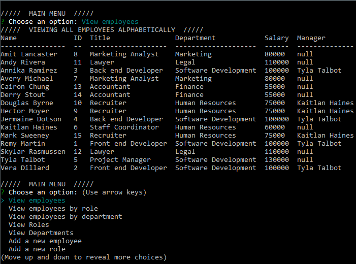

# Employee-Tracker
## An application to manage an employee database using MySQL

## Description:
This application is a Content Managment System for a MySQL database of employee data. Data includes Name, title, salary, department, and manager. Employee data can displayed sorted alphabetically, by role, or by department. New employees, roles, and departments can be added. Existing employees' roles can be changed.

## Table of Contents:
[User Story](#User-Story) 
[Installation](#Installation) 
[Usage](#Usage) 
[Tests](#Tests) 
[Contributions](#Contributions) 
[Contact](#Contact) 
[License](#License) 

## User Story:
- AS A business owner
- I WANT to be able to view and manage the departments, roles, and employees in my company
- SO THAT I can organize and plan my business

## Installation:
If you want to use or develop this application locally, clone the repository and install dependencies by running `npm i` in your terminal in the root folder. 
Start the application by running `node index` in your terminal in the root folder. 
The MySQL connection uses a `.env` to hold a password. Create a `.env` file or replace with field in `index.js` with a hardcoded password. 

## Usage:
Displaying all employees ordered alphabetically: 
 
Adding a new employee: 
 

## Tests:
No tests are currently included.

## Contributions:
Technologies used include JavaScript, Node.js, MySQL, Inquirer, and console.table.

## Contact:
Check out my [Github](https://github.com/MonsAltus). 
Email me at <hacklander.dev@gmail.com>

## License:
Covered under the [MIT License](https://github.com/MonsAltus//Employee-Tracker/blob/main/LICENSE).
