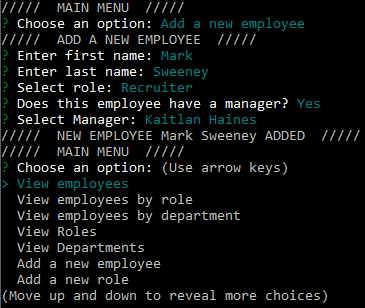

# Employee-Tracker
## An application to manage an employee database using MySQL

## Description:
This application allows users to manage a MySQL database of employee data, including assigning or viewing their roles and departments.

## Table of Contents:
[User Story](#User-Story) 
[Installation](#Installation) 
[Usage](#Usage) 
[Tests](#Tests) 
[Contributions](#Contributions) 
[Contact](#Contact) 
[License](#License) 

## User Story:
- AS A 
- I WANT 
- SO THAT I 

## Installation:
If you want to use or develop this application locally, clone the repository and install dependencies by running `npm i` in your terminal in the root folder.
Start the application by running `node app` into you terminal in the root folder.

## Usage:
[GIF of app functionality](./assets/preview1.gif)
 

## Tests:
No tests are currently included.

## Contributions:
Technologies used include JavaScript, Node.js, MySQL, Inquirer, and console.table.

## Contact:
Check out my [Github](https://github.com/MonsAltus). 
Email me at <hacklander.dev@gmail.com>

## License:
Covered under the [MIT License](https://github.com/MonsAltus//Employee-Tracker/blob/main/LICENSE).
